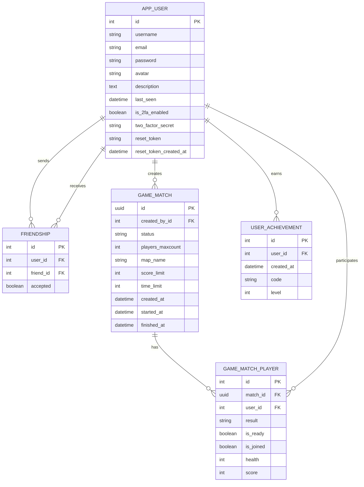

*This project has been created as part of the 42 curriculum by sskobyak, irkalini, kleung-t, dgibrat*

## Team Information

| Member | Role |
|---|---|
| sskobyak | Tech lead and developer, responsible for technical direction and implementation |
| irkalini | Project manager and developer, responsible for coordination and feature delivery |
| kleung-t | Product owner and developer, responsible for product vision and feature priorities |
| dgibrat | Project manager and developer, responsible for planning and implementation follow-up |

# Robot-Battle

## Description

Transcendence (Robot-Battle) is a full‑stack web application that enables real‑time, browser‑based multiplayer matches with social features and persistent progression.

Goal: provide a polished multiplayer experience where players can create or join synchronized matches, communicate via real‑time chat, track statistics and achievements, and play responsive 3D matches directly in the browser.

Overview: the backend uses Django for real‑time WebSockets and JWT/OAuth authentication (Google and 42); the frontend is a React + Vite SPA using Three.js for game rendering. The project includes optional 2FA, a friends system, match lifecycle management, internationalization (en/fr/ru), and deployment scaffolding with an HTTPS nginx proxy to enable secure HTTPS and WSS connections.

### Goal

Provide a real-time, browser-based platform where users can:
- create and join multiplayer matches,
- play live synchronized games,
- interact through social features,
- track progression through statistics and achievements.

### Key Features

- User authentication (register, login, JWT)
- OAuth2 login (Google, 42)
- Two-factor authentication (2FA with OTP + QR setup)
- User profile management (including avatar upload)
- Friends system (search, add, accept, remove, online presence)
- Real-time chat via WebSockets
- Real-time multiplayer game via WebSockets
- Match lifecycle management (create, join, ready, live, finish)
- Match history and player statistics
- Achievements and milestones endpoints
- Internationalization (English, French, Russian)
- 3D frontend stack based on Three.js ecosystem

## Instructions

### Prerequisites

- Linux/macOS shell environment
- make
- Python 3
- pip
- virtualenv (python3 -m venv)
- Node.js
- npm

### Environment Configuration

Create a file at back/.env with:

```env
SECRET_KEY=
GOOGLE_CLIENT_ID=
GOOGLE_CLIENT_SECRET=
GOOGLE_REDIRECT_URI=
E42_CLIENT_ID=
E42_CLIENT_SECRET=
E42_REDIRECT_URI=
FRONTEND_URL=
BACKEND_URL=
```

### Installation

#### Option 1 (recommended)

```bash
make i
```

#### Option 2 (manual)

Backend:

```bash
cd back
python3 -m venv venv
source venv/bin/activate
pip install -r requirements.txt
python preload_model.py
python manage.py migrate
```

Frontend:

```bash
cd front
npm install
```

### Run

#### Option 1 (separate)

Backend:

```bash
make back
```

Frontend:

```bash
make front
```

#### Option 2 (manual)

Backend:

```bash
cd back
source venv/bin/activate
daphne -b 0.0.0.0 -p 8000 core.asgi:application
```

Frontend:

```bash
cd front
npm run dev
```

### Alternative Docker Run

run over https with self-signed certificates:

```bash
make prod
```

Open in browser:

```bash
https://localhost:8080
```

### Useful Commands

Backend migrations:

```bash
cd back
source venv/bin/activate
python manage.py makemigrations
python manage.py migrate
```

Localization:

```bash
cd back
source venv/bin/activate
python manage.py makemessages -l ru -l fr
python manage.py compilemessages
```

## Project Management

### Work Organization

- sskobyak handled the backend.
- irkalini worked on CSS and Tailwind for UI/UX.
- kleung-t facilitated team coordination and removed obstacles.
- dgibrat developed the web game on the frontend.

### Project Management Tools

- GitHub Issues: used to track tasks, bugs, and feature progress.
- GitHub Pull Requests: used to review changes, discuss implementation, and merge work safely.

### Communication Channels

- Discord group: used for day-to-day team communication and quick coordination.

## Technical Stack

### Frontend

- React
- Vite
- Tailwind CSS
- Three.js

### Backend

- Django
- Django REST Framework

### Database

- SQLite (Django default engine)

### Other Significant Libraries

- Channels (ASGI/WebSockets)
- Daphne
- Three.js 
- Tailwind CSS
- Zustand
- i18next

### Technical Choices and Rationale

- Django + DRF: rapid API development, admin ecosystem, mature authentication stack.
- Channels + Daphne: native real-time support for multiplayer gameplay and chat.
- React + Vite: fast developer workflow and modern frontend architecture.
- Three.js stack: enables advanced 3D rendering and real-time scene interaction.
- SQLite: simple setup for development and project portability.

## Database Schema

### Entities and Relationships



Model mapping: `APP_USER -> User`, `FRIENDSHIP -> Friend`, `GAME_MATCH -> Match`, `GAME_MATCH_PLAYER -> MatchPlayer`, `USER_ACHIEVEMENT -> Achievement`.

### Key Constraints

- One player can appear only once per match (unique match_id + user_id).
- Friend relationships are stored as directional rows and mirrored when accepted.
- Match IDs use UUID for globally unique room/match identifiers.

## Features List

| Feature | Description | Team member(s) |
|---|---|---|
| User registration and login | Account creation and JWT-based authentication flow. | sskobyak |
| OAuth2 authentication | Login via Google and 42 OAuth providers. | kleung-t |
| Two-factor authentication | Enable/confirm 2FA and verify OTP during login. | kleung-t, sskobyak |
| Profile system | Retrieve and update profile data, including avatar and description. | irkalini |
| Friends system | Search users, send requests, accept requests, delete friendships. | irkalini |
| Online presence | Friend list includes recent activity-based online status. | sskobyak |
| Real-time chat | WebSocket chat room with message broadcast and room history. | sskobyak |
| Matchmaking and lobbies | Create/join matches and manage pre-game readiness. | sskobyak |
| Real-time multiplayer game | WebSocket synchronized game state updates between clients. | dgibrat |
| Spectator mode | Current/live matches can be listed and watched in real time. | dgibrat |
| Match history | User-specific match history with sorting and pagination. | sskobyak |
| Statistics | Per-user and global stats endpoints. | sskobyak |
| Achievements and milestones | Persistent achievement records and milestone endpoints. | sskobyak |
| Internationalization | Multi-language support (en/fr/ru) across backend and frontend. | irkalini |
| 3D game rendering | Advanced 3D stack and rendering using Three.js ecosystem. | dgibrat |
| Responsiveness | Responsive layout across desktop and mobile interfaces. | irkalini |
| Game design | Visual and gameplay design for a coherent player experience. | dgibrat |
| Game responsiveness | Responsive game UI and in-game adaptation across screen sizes. | dgibrat |

## Modules

### Selected Modules and Points

| Module | Type | Points | Why this module was chosen | How it was implemented | Team member(s) |
|---|---:|---:|---|---|---|
| Use a frontend framework (React) | Minor | 1 | To build a maintainable SPA with reusable components and fast UI iteration. | React + Vite frontend architecture. | irkalini `dgibrat|
| Use a backend framework (Django) | Minor | 1 | To speed up API delivery with a mature, secure, and well-documented framework. | Django REST backend with modular apps. | sskobyak |
| Use an ORM for the database | Minor | 1 | To simplify data modeling, migrations, and query consistency across the project. | Django ORM models and migrations. | sskobyak |
| OAuth2 remote authentication | Minor | 1 | To provide convenient login options and reduce password-only dependency. | Google and 42 OAuth callback/token exchange endpoints. | kleung-t |
| Complete 2FA system | Minor | 1 | To increase account security with a second verification factor. | pyotp secret generation, QR provisioning, OTP verification. | kleung-t, sskobyak |
| Standard user management and authentication | Major | 2 | To cover the core user lifecycle from signup to profile and social access control. | Register/login/profile/avatar/friends/online status. | sskobyak |
| Real-time features with WebSockets | Major | 2 | To support low-latency bidirectional communication required by chat and gameplay. | Django Channels consumers for chat and game state. | sskobyak |
| User interactions (chat/profile/friends) | Major | 2 | To make the platform social and collaborative, not only game-focused. | REST + WebSocket interactions across users/friends/chat. | sskobyak irkalini |
| Multi-language support (3 languages) | Minor | 1 | To make the application accessible to a broader user base. | i18n backend locales + frontend translation support. | irkalini |
| Advanced 3D graphics | Major | 2 | To deliver a more immersive and distinctive game experience. | Three.js + react-three ecosystem in game frontend. | dgibrat |
| Complete web-based multiplayer game | Major | 2 | To fulfill the main project objective: a full online multiplayer experience in browser. | Live matches with rules, scores, and finish state. | dgibrat |
| Multiplayer game (>2 players) | Major | 2 | To improve gameplay depth and support richer match formats. | players_maxcount support and synchronized room state. | dgibrat |
| Advanced search (filters/sorting/pagination) | Minor | 1 | To keep user and match exploration usable as data volume grows. | User search + stats/matches sorting and pagination endpoints. | sskobyak |
| Game statistics and match history | Minor | 1 | To provide progression tracking and post-game analysis for players. | Stats endpoints, per-user match history, achievements. | sskobyak |
| Gamification system | Minor | 1 | To increase long-term engagement through rewards and milestones. | Achievement model and reward generation at match end. | sskobyak |
| Spectator mode | Minor | 1 | To enable community viewing and make ongoing matches observable in real time. | Listing and viewing current live matches in real time. | dgibrat |
| Remote players real-time gameplay | Major | 2 | To ensure synchronized gameplay between players connected from different locations. | Networked match state broadcast and sync over WebSockets. | dgibrat |
| Custom design system (reusable components) | Minor | 1 | To keep UI consistent and speed up frontend development. | Reusable UI components in frontend component structure. | irkalini |
| Additional browser support | Minor | 1 | To improve accessibility by ensuring a stable experience across major browsers. | Cross-browser testing and compatibility fixes on core pages and game UI. | irkalini, sskobyak |

**Total points:** 28

## Individual Contributions

### sskobyak

- Designed and implemented the core backend architecture with Django and DRF.
- Implemented core social/backend features: profile, friends, online presence, and real-time chat/matchmaking support.
- Built progression and analytics endpoints: match history, statistics, achievements, and milestones.
- Maintained key ORM models, migrations, and API consistency across backend modules.

### irkalini

- Implemented major UI/UX work using CSS/Tailwind and responsive layouts.
- Integrated internationalization support for English, French, and Russian.
- Contributed reusable frontend component patterns to keep the UI consistent.
- Improved browser compatibility and frontend reliability across major environments.

### kleung-t

- Led product ownership activities: feature prioritization, scope alignment, and roadmap decisions.
- Delivered authentication flows: registration/login (JWT), OAuth2 (Google/42), and complete 2FA.
- Coordinated team execution by organizing tasks, clarifying requirements, and unblocking delivery.
- Ensured continuous alignment between project goals and implementation progress.

### dgibrat

- Designed and implemented the real-time multiplayer game frontend using the Three.js ecosystem.
- Developed synchronized live gameplay behavior for remote players.
- Implemented spectator-related real-time game viewing capabilities.
- Drove game design decisions and game-specific responsive behavior across device sizes.


## Challenges and Solutions

### Real-time synchronization
Synchronizing remote players with low latency while avoiding desync issues was one of the major technical challenges.
This was addressed through WebSocket-based state broadcasting and authoritative match state management on the backend.

### 3D performance
Rendering multiple live entities in browser while maintaining responsive gameplay required optimization of scene updates and rendering cycles.

### Authentication complexity
Combining JWT, OAuth2, and 2FA introduced edge cases in authentication flows.
The team implemented isolated validation layers and extensive local testing to ensure stability.


## Resources

### Project Documentation and References

- React: https://react.dev/
- Django: https://docs.djangoproject.com/
- Django REST Framework: https://www.django-rest-framework.org/
- Channels: https://channels.readthedocs.io/
- Vite: https://vitejs.dev/
- Tailwind CSS: https://tailwindcss.com/docs/
- shadcn/ui: https://ui.shadcn.com/
- Three.js: https://threejs.org/docs/
- React Three Fiber: https://docs.pmnd.rs/react-three-fiber/getting-started/introduction
- i18next: https://www.i18next.com/

### AI Usage

AI tools were used as support tools during development and documentation.

- Tools used: GitHub Copilot and ChatGPT.
- Main use cases: drafting/refactoring small code blocks, generating alternative implementation ideas, improving documentation wording, and speeding up debugging hypotheses.
- Usage boundaries: architectural decisions, feature scope, and final implementation choices were made by the team.
- Validation process: all AI-generated suggestions were manually reviewed, adapted to project requirements, and verified through local testing before being kept.
- Data handling: no secrets, private tokens, or sensitive credentials were intentionally shared with AI tools.
